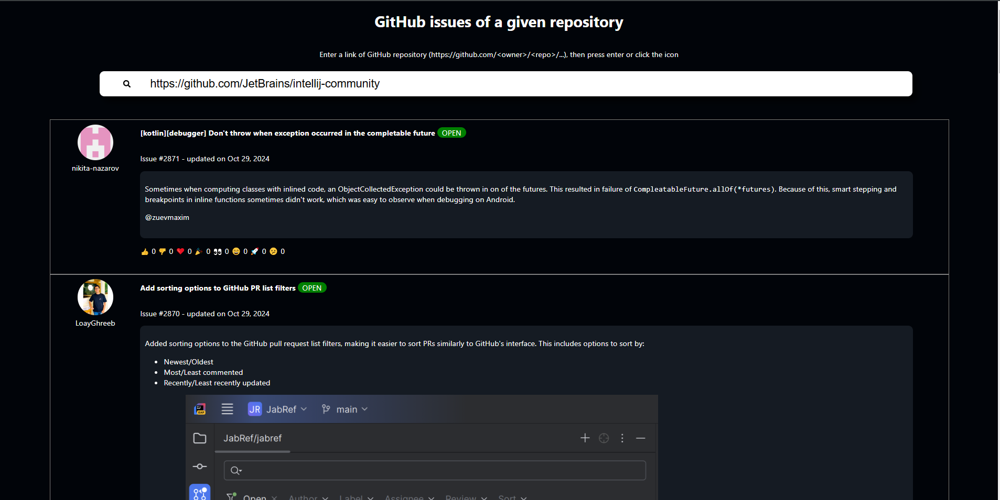

# React client to display issues from a given Github Repository

## Authentification
To make it simpler and safer, I will make it unauthenticated, no need for a token. It means the limit is 60 requests per minute.

## Endpoint
I am using this endpoint from the GitHub REST API to fetch the issues of a given repository 
https://docs.github.com/en/rest/issues/issues?apiVersion=2022-11-28#list-repository-issues

## Dependencies
I used react-markdown library to render markdown (the content of the issues / comments) into the website.

## Error management
When entering a github repository url, if it's invalid the error is handled simply by showing a messager under the search box.

## Features
There is a pagination system, it's possible to navigate between pages (buttons are at the bottom of the page).
For each issue / comments, the reactions are displayed using emojis

For each issue, if there are comments it's possible show them by clicking the 'show' text.

## Usage
To start the react application:

install packages with `npm install` 
then start development server with `npm start`